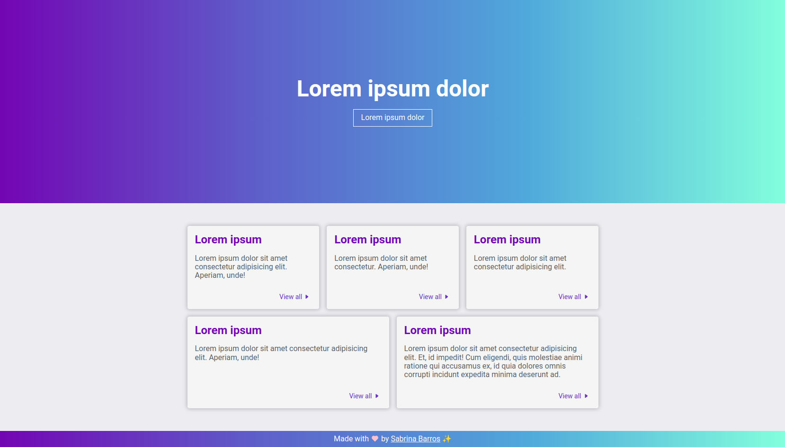

# [Ditto Boilerplate ✨](https://sabrinabarros.github.io/ditto-boilerplate/src/index.html#)

The **ditto-boilerplate** project is a simple and elegant front-end boilerplate, developed with HTML and vanilla CSS. It features a structure of cards for displaying information, as well as a modern and functional header and footer.

> If you found this project helpful or useful, please consider giving it a ⭐



[❤️ Available on GitHub Pages :octocat:](https://sabrinabarros.github.io/ditto-boilerplate/src/index.html#)

## Installation 🔧

To use **ditto-boilerplate**, simply download or clone the repository to your local machine.

1. Clone the repository to your local machine using:

```
git clone https://github.com/SabrinaBarros/ditto-boilerplate.git
```

Or download the ZIP file and extract it to your preferred directory.

2. Open the index.html file located in the `src` directory in your preferred browser.

And that's it! You can now start customizing the project to fit your needs.

## Usage 🪄

**ditto-boilerplate** provides a clean and intuitive structure to build your own front-end project. You can easily customize the CSS to match your design preferences and add your own content to the cards. The header and footer are also easily customizable.

## Contributing 💌

This project was created as a personal initiative to develop my front-end skills and share my work with the community. It is constantly evolving and always open to contributions and constructive feedback. If you would like to contribute to the project, feel free to check the [CONTRIBUTING](CONTRIBUTING.md) file for more information. 

## License 📃

[MIT License](https://github.com/SabrinaBarros/retro-games-api/blob/master/LICENSE.md) © [Sabrina Barros](https://github.com/SabrinaBarros)